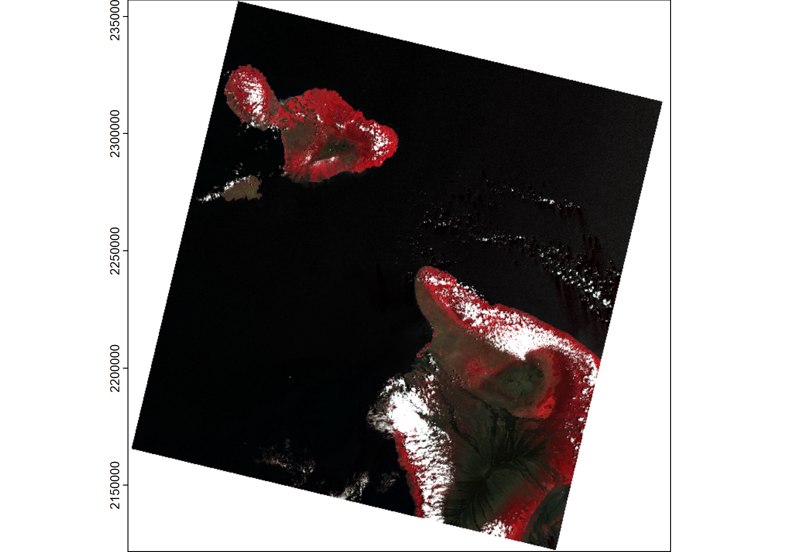

# Impact of Submarine Groundwater Discharge on Marine Water Quality and Reef Biota of Maui

## Raster Manipulation & Image Processing

### Visualization of landsat bands 1 - 6

### Colorization of images

### Image cropping - only Maui

## Visualizing Maui

A - Honolua,
B - Honomanū,
C - Kahului,
D - Māʻalaea,
E - Kūʻau,
F - Waiehu

