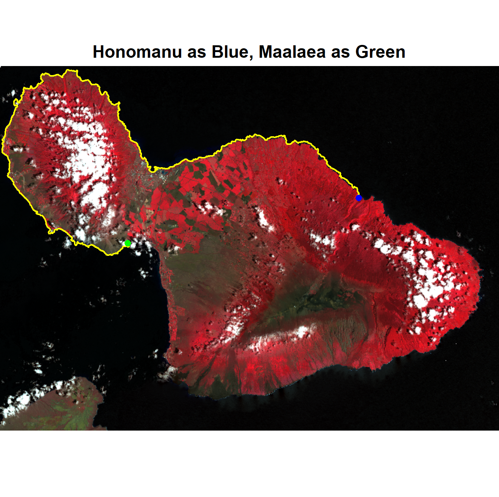

# Impact of Submarine Groundwater Discharge on Marine Water Quality and Reef Biota of Maui

## Raster Manipulation & Image Processing

### Visualization of landsat bands 1 - 6

### Data preprocessing and cleaning - only Maui

## Visualizing Maui study points

A - Honolua,
B - Honomanū,
C - Kahului,
D - Māʻalaea,
E - Kūʻau,
F - Waiehu

## Coastline Extraction, Masking & Distance Calculation

Transition map of the coastline allows to visualize and calculate distances on water between study points. Here the cost map for the distance between Māʻalaea, and Kūʻau is shown on a colorized map of the island where the rgb channels correspond to bands #: r = "B5", g = "B4", b = "B3".

