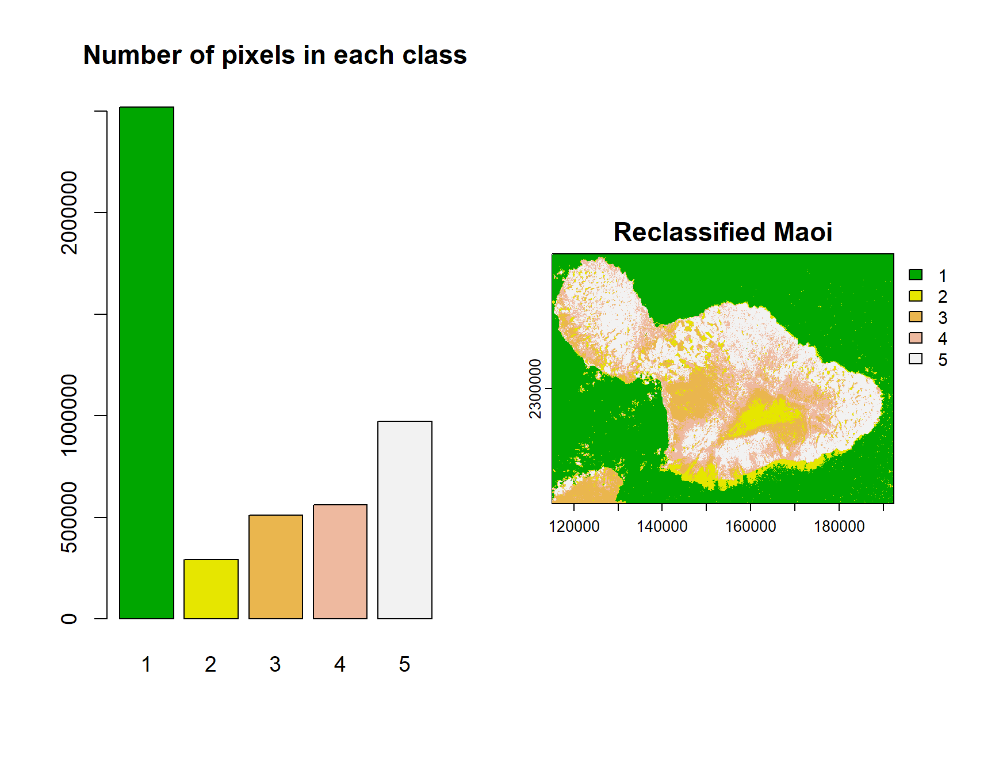

# Impact of Submarine Groundwater Discharge on Marine Water Quality and Reef Biota of Maui

# Image-Analysis
This project analyzes Landsat 8 satellite imagery to classify land, extract coastlines, and compute least-cost paths using `terra`, `sf`, and `gdistance`. 
My personal objective with the project is learning how to perform digital image analysis in R using the raster, terra, sp and gdistance packages, and to do this I will recreate the analysis performed in the paper. 

## Technologies Used  
- R (`terra`, `factoextra`, `gdistance`, `sp`)  
- Satellite Imagery (Landsat 8)  
- Spatial Analysis (K-means clustering, raster classification, transition matrix, least cost distance)

## Impact of Submarine Groundwater Discharge on Marine Water Quality and Reef Biota of Maui
In the paper the authors analyzed how submarine groundwater discharge (SGD) can transport potentially large loads of nutrients and other land-based contaminants to coastal ecosystems, studying the relationships between water and algal tissue nutrients. They employed algal bioassays, benthic community analysis, and geochemical methods to examine water quality and community parameters of nearshore reefs adjacent to a variety of potential, land-based nutrient sources on Maui. 

This project is taken from PMCID: PMC5094668  PMID: 27812171. The authors used ArcGIS, ArcMap for the geospatial analysis, and SigmaPlot 11 for statistical analysis. The data of the papers is available to the public through the NOAA National Centers for Environmental Information (NCEI). The NCEI Accession Number 0156294 is now publicly accessible online via the NCEI Ocean Archive System at http://accession.nodc.noaa.gov/0156294. These data are discoverable via the NCEI Geoportal (http://data.nodc.noaa.gov/geoportal).

## Raster Manipulation & Image Processing

- Reading geospatial data (raster and vector formats)

### Visualization of landsat bands 1 - 6

## Raster Processing

- Stacking raster layers to create multispectral images (R = B4, G = B3, B = B2)
- Cropping and masking images (reducing image size, isolating AOIs).
- Change coordinate reference system (CRS) and visualize breaks on cropped map. 

## Visualizing Maui study points

A - Honolua,
B - Honomanū,
C - Kahului,
D - Māʻalaea,
E - Kūʻau,
F - Waiehu

## Image processing

- Histogram-based analysis for feature identification.

- K-means clustering for land classification

## Coastline Extraction, Masking & Distance Calculation

- Identifying land-water boundaries using classification.
- Creating masks for land and water.
- Extracting coastline features using spatial operations.
- Buffering coastlines to define zones.
- Rasterizing vector data for further analysis.
- Computing least-cost paths and transition matrices for spatial movement.

